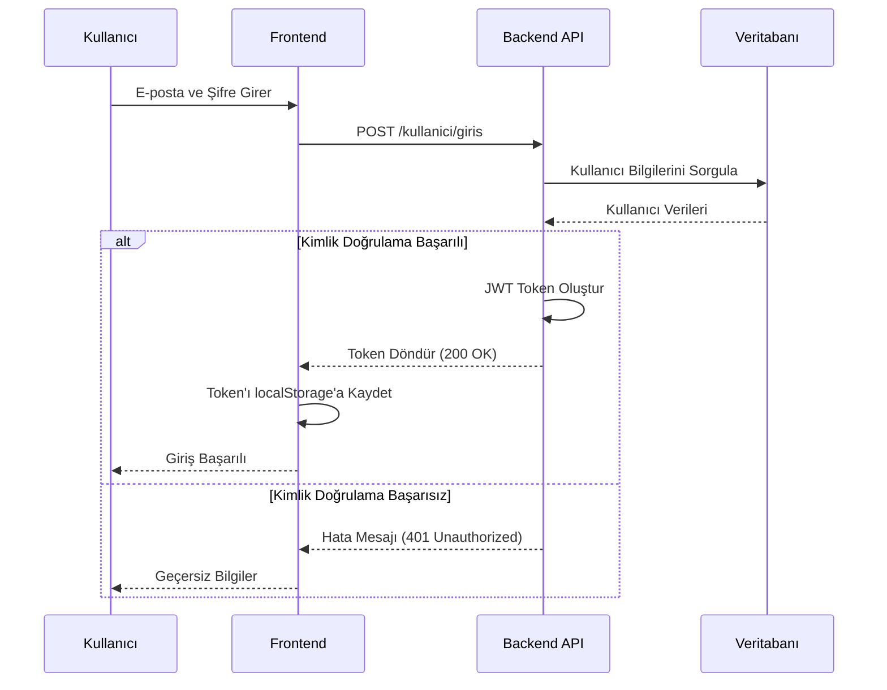
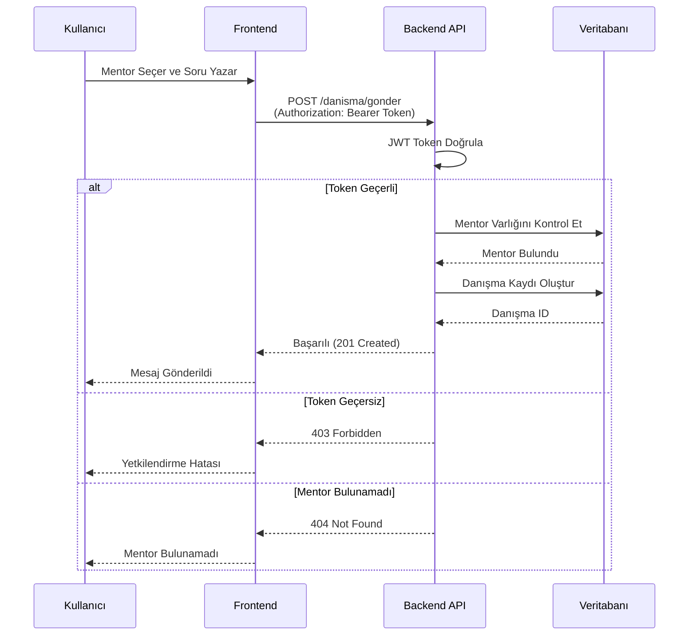
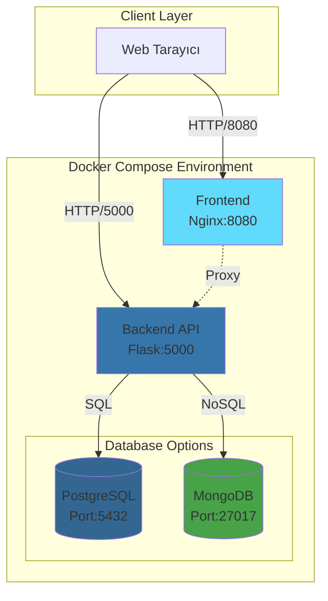
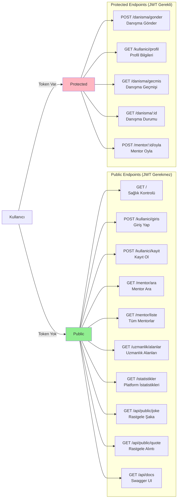
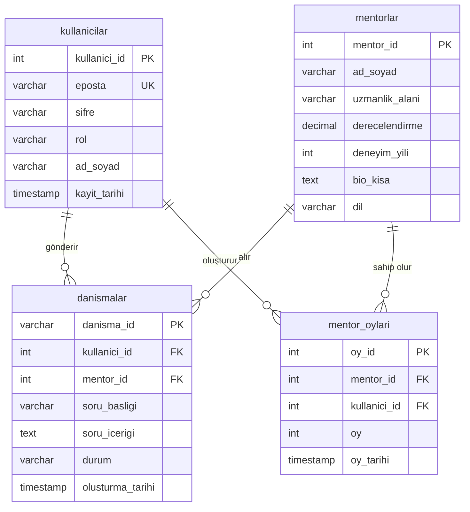
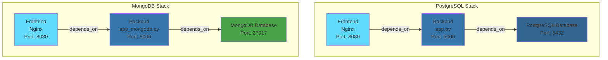

# MermaidJS Diyagramları

Bu dosya, "Bir Bilene Danış" uygulamasının çeşitli süreçlerini görselleştiren MermaidJS diyagramlarını içerir.

## 1. Kullanıcı Kimlik Doğrulama Akışı (JWT Token)

## 2. Danışma Gönderme Akışı (JWT Korumalı Endpoint)

## 3. Sistem Mimarisi

## 4. API Endpoint'leri Akış Diyagramı

## 5. Veritabanı İlişkileri (PostgreSQL)

## 6. Docker Compose Servis İlişkileri

## Diyagramları Görüntüleme

Bu diyagramları görüntülemek için:

1. **GitHub**: Bu dosyayı GitHub'da açın, MermaidJS otomatik olarak render edilir
2. **VS Code**: Mermaid extension yükleyin
3. **Online**: [Mermaid Live Editor](https://mermaid.live/) kullanın
4. **Markdown Preview**: Mermaid destekli bir Markdown görüntüleyici kullanın

## Diyagramların Açıklamaları

### Sequence Diagram 1: Kullanıcı Kimlik Doğrulama
- Kullanıcının sisteme giriş yapma sürecini gösterir
- JWT token oluşturma ve localStorage'a kaydetme adımlarını içerir
- Başarılı ve başarısız senaryoları kapsar

### Sequence Diagram 2: Danışma Gönderme
- JWT token ile korumalı endpoint kullanımını gösterir
- Token doğrulama sürecini detaylandırır
- Mentor kontrolü ve danışma kaydı oluşturma adımlarını içerir

### Architecture Diagram 3: Sistem Mimarisi
- Docker Compose ile çalışan servisleri gösterir
- İki farklı veritabanı seçeneğini (PostgreSQL/MongoDB) gösterir
- Port numaralarını ve bağlantıları gösterir

### Flow Diagram 4: API Endpoints
- Public ve protected endpoint'leri ayırır
- JWT gerektiren ve gerektirmeyen endpoint'leri gruplar
- API'nin tüm yeteneklerini görselleştirir

### ER Diagram 5: Veritabanı Şeması
- PostgreSQL veritabanı tablolarını ve ilişkilerini gösterir
- Primary ve Foreign key ilişkilerini gösterir
- Tablo alanlarını ve veri tiplerini listeler

### Deployment Diagram 6: Docker Compose
- İki farklı deployment seçeneğini gösterir (PostgreSQL ve MongoDB)
- Servisler arası bağımlılıkları gösterir
- Her servisin portlarını belirtir

